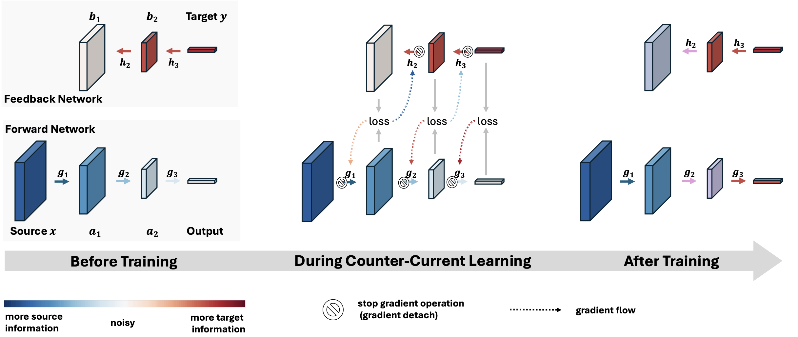

# Counter-Current Learning (NeurIPS 2024)

[Chia-Hsiang Kao](https://iandrover.github.io), [Bharath Hariharan](https://www.cs.cornell.edu/~bharathh/)

[](https://arxiv.org/abs/2409.19841)

Counter-Current Learning (CCL) is a biologically-inspired alternative to the backpropagation algorithm for training neural networks. This repository provides an implementation of the CCL framework and includes code for running image classification experiments using Multi-Layer Perceptrons (MLP) and Convolutional Neural Networks (CNNs).

## Overview

### Biological Implausibility of Error Backpropagation (BP)
Error backpropagation, while widespread in neural network applications, is criticized for its lack of biological plausibility. It suffers from issues such as the weight transport problem, non-local credit assignment, and backward locking—challenges that starkly contrast with natural neural processes.

### Inspiration from Biological Counter-Current Systems
In nature, counter-current systems are more efficient than co-current systems in molecular and energy exchange. This biological principle inspires our approach to neural network learning.


### Implementing Counter-Current Systems in Learning
Our work is driven by the question: Can we exchange information between source and target signals, akin to the energy exchange in counter-current flows?

We introduce a dual network architecture for neural learning, named Counter-Current Learning. This framework includes a feedforward network for input data processing and a feedback network for target data processing, enhancing each other through anti-parallel signal propagation.

This design addresses the non-locality and backward locking issues inherent in traditional backpropagation by separating the dependency of forward and backward processes. Specifically, it leverages noisy signals from the top layer of the feedforward network and informative signals from the bottom layer of the feedback network, allowing the latter to guide the optimization of the former and enhancing overall learning efficacy.



## Running Experiments
Run classification experiments using the provided Python scripts for MLP and CNN architectures. For classification, we use `CIFAR-10` for example. 

Before running experiments, please install `pytorch` and `torchvision`.

### Multi-Layer Perceptron (MLP)
```bash
# Backpropagation
python main_class_mlp.py --yaml './yaml/mlp/cifar10_bp.yaml'

# Counter-Current Learning
python main_class_mlp.py --yaml './yaml/mlp/cifar10_ccl.yaml'
```

### Convolutional Neural Network (CNN)
```bash
# Backpropagation
python main_class_cnn.py --yaml "./yaml/cnn/cifar10_bp.yaml"

# Counter-Current Learning
python main_class_cnn.py --yaml "./yaml/cnn/cifar10_ccl.yaml"
```

### Auto-Encoder on STL-10
```bash
# Backpropagation
python main_ae.py --yaml './yaml/cnn_ae/stl10_bp_legacy.yaml'


# Counter-Current Learning
python main_ae.py --yaml './yaml/cnn_ae/stl10_ccl_legacy.yaml'
```

### Script Arguments
```bash
--yaml: Path to the YAML configuration file.
--lr_F, --lr_B: Learning rates for forward and backward networks, respectively.
--mmt_F, --mmt_B: Momentum parameters for forward and backward networks.
--grad_clip_F, --grad_clip_B: Gradient clipping thresholds for forward and backward networks.
--batchsize: Batch size.
--epochs: Total number of training epochs.
--warmup: Number of warmup steps.
--loss_scale_C: Loss scaling factor (only for CCL).
--seed: Random seed (useful for reproducibility).
```
Experiment with different settings for learning rates, momentum, gradient clipping, and seeds as shown in the example commands.
